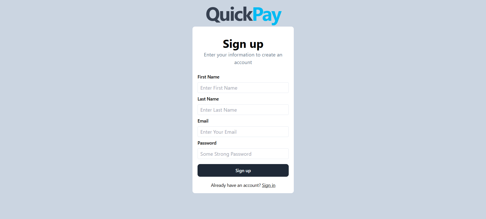
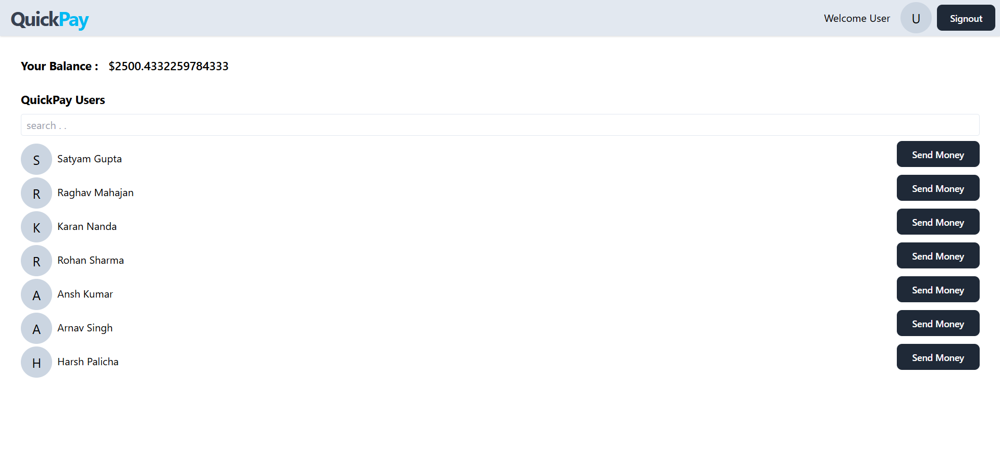
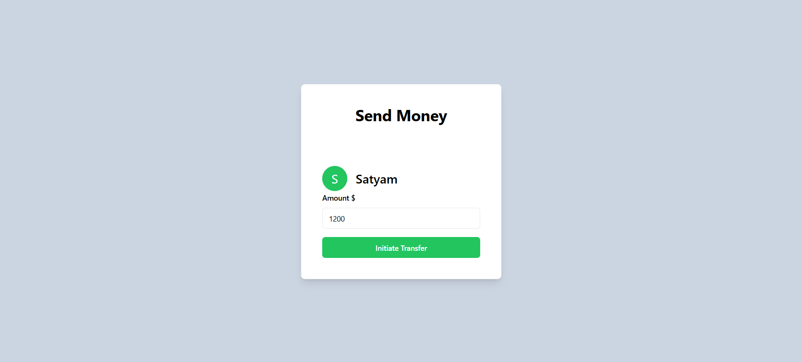

# QuickPay

QuickPay is a Full-Stack application that allows users to perform secure transactions, view their account balance and interact with other users

## Features

- Allows secure transactions between users 
- Users can view real time account balances
- Offers a responsive and visually appealing design with TailwindCSS
- Protects user data with JWT authentication and bcrypt for password hashing

## Technologies Used

- **Frontend**:  
  - [React](https://reactjs.org/) - for user interface  
  - [Tailwind CSS](https://tailwindcss.com/) - for styling

- **Backend**:  
  - [Node.js](https://nodejs.org/) - server environment  
  - [Express](https://expressjs.com/) - as backend framework

- **Database**:  
  - [MongoDB](https://www.mongodb.com/) - as NoSQL database  
  - [Mongoose](https://mongoosejs.com/) - for object modeling

- **Security**:  
  - [bcrypt](https://www.npmjs.com/package/bcrypt) - for password hashing  
  - [JWT](https://jwt.io/) - for authorization and authentication

- **Data Validation**:  
  - [Zod](https://zod.dev/) - for schema-based validation

- **Data Fetching**:  
  - [Axios](https://axios-http.com/) - for HTTP requests

- **Deployment**:  
  - [Vercel](https://vercel.com/) - for frontend deployment  
  - [Render](https://render.com/) - for backend deployment

## Visual Overview

### User Signup Interface

### User Signin Interface

### User Dashboard Overview

### Money Transfer Interface

