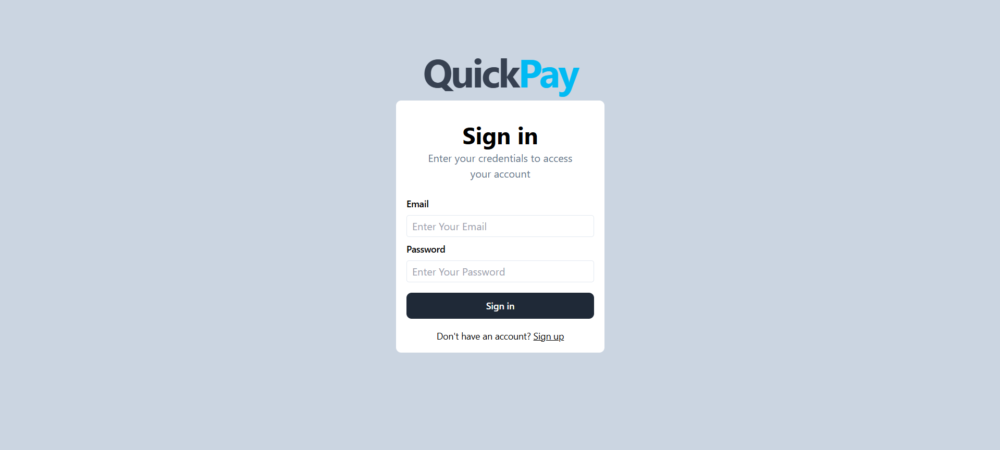

# QuickPay

QuickPay is a Full-Stack application that allows users to perform secure transactions, view their account balance and interact with other users

## Features

- Allows secure transactions between users 
- Users can view real time account balances
- Offers a responsive and visually appealing design with TailwindCSS
- Protects user data with JWT authentication and bcrypt for password hashing

## Technologies Used

### Frontend:
- React - For user interface
- Tailwind CSS - For styling
- React Hot Toast - For notifications

### Backend:  
- Node.js - Server environment  
- Express - Backend framework

### Database:  
- MongoDB - NoSQL database  
- Mongoose - Object modeling

### Security:  
- Bcrypt - Password hashing  
- JWT - Authorization and authentication

### Data Validation:  
- Zod - Schema-based validation

### Data Fetching:  
- Axios - HTTP requests

### Deployment:  
- Vercel - Frontend deployment  
- Render - Backend deployment

## Visual Overview

### User Signup Interface

### User Signin Interface

### User Dashboard Overview

### Money Transfer Interface
